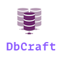

# DBCraft


DBCraft es un proyecto de intérprete diseñado para facilitar las migraciones de bases de datos y la gestión de esquemas en múltiples lenguajes de programación. El objetivo principal de **DBCraft** es proporcionar una sintaxis intuitiva y unificada para definir y modificar estructuras de bases de datos, permitiendo a los desarrolladores evolucionar sus esquemas de manera sencilla y controlada.

## Idiomas
Esta documentación está disponible en los siguientes idiomas:
- [Español](README.md)
- [Inglés](english.md)


## Inspiración en YAML

DBCraft está inspirado en YAML, pero con algunas adaptaciones y ajustes para satisfacer las necesidades específicas de la gestión de esquemas de bases de datos. La sintaxis se ha simplificado y se han agregado atributos personalizados para definir campos, tablas, relaciones y otros elementos de manera intuitiva.


## Características

- Sintaxis simplificada y legible para definir y gestionar esquemas de bases de datos.
- Soporte multiplataforma para lenguajes de programación populares.
- Migración eficiente y transformación de estructuras y datos de bases de datos.
- Actualización de estructuras a través de ficheros de scripting (.tmg)
- Control de versiones y seguimiento de cambios en los esquemas.
- Integración con varios sistemas de gestión de bases de datos.


## Lenguajes Soportados

- Visual Foxpro 9.0
- Windev (WLanguage)

## Ejemplo

A continuación se muestra un ejemplo de cómo se vería la definición de una tabla en DBCraft:

```yaml
- table:
  name: clientes
  description: "Tabla que almacena la información de los clientes."
  fields:
    - name: id
      type: int
      size: 10      
      primaryKey: true
      autoIncrement: true
      description: "Identificador único auto incremental para el cliente."

    - name: nombre
      type: varchar
      size: 50
      allowNull: false
      description: "Nombre del cliente."

    - name: email
      type: varchar
      size: 100
      allowNull: true
      description: "Dirección de correo electrónico del cliente."

    - name: phone
      type: varchar
      size: 20
      allowNull: true
      description: "Móvil del cliente."

    - name: address
      type: varchar
      size: 100
      allowNull: true
      description: "Dirección del cliente."

    - name: created_at
      type: datetime
      allowNull: false
      description: "Fecha y hora de creación del cliente."

    - name: updated_at
      type: datetime
      allowNull: true
      description: "Fecha y hora de la última actualización del cliente."
```

## Este ejemplo muestra como definir una tabla con claves foráneas

```yaml
# Definición de la tabla "Clientes"
- table:
  name: Clientes
  description: "Tabla que almacena información de los clientes."
  fields:
    - name: id
      type: int
      size: 11
      autoIncrement: true
      primaryKey: true
    - name: nombre
      type: varchar
      size: 100
    - name: direccion
      type: varchar
      size: 200

# Definición de la tabla "Facturas"
- table:
  name: Facturas
  description: "Tabla que almacena información de las facturas."
  fields:
    - name: id
      type: int
      size: 11
      autoIncrement: true
      primaryKey: true
    - name: cliente_id
      type: int
      size: 11
      foreignKey:
        fkTable: Clientes
        fkField: id
        onDelete: cascade
        onUpdate: restrict
    - name: fecha
      type: date

# Definición de la tabla "DetalleFactura"
- table:
  name: DetalleFactura
  description: "Tabla que almacena el detalle de las facturas."
  fields:
    - name: id
      type: int
      size: 11
      autoIncrement: true
      primaryKey: true
    - name: factura_id
      type: int
      size: 11
      foreignKey:
        fkTable: Facturas
        fkField: id
        onDelete: cascade
        onUpdate: restrict
    - name: producto
      type: varchar
      size: 100
    - name: cantidad
      type: int
      size: 11
    - name: precio
      type: double
      size: 10
      decimal: 2
```

## Contribuciones

¡Contribuciones y sugerencias son bienvenidas! Si deseas colaborar con el desarrollo de DBCraft o tienes ideas para mejorarlo, no dudes en crear una solicitud de extracción (pull request) o abrir un problema (issue) en el repositorio.

## Tutorial

[Este tutorial](tutorial.md) te explicará todos y cada uno de los atributos que necesitas saber para comenzar a crear tus tablas.

## Licencia

DBCraft se distribuye bajo la licencia MIT. Consulta el archivo LICENSE para más detalles.

Do you like or benefit from my work? please consider make a donation, a cup of coffee would be nice!

## Donaciones

Si encuentras útiles las herramientas que he desarrollado y te gustaría apoyar mi trabajo, considera realizar una donación. Tu contribución ayudará a mantener y mejorar este proyecto, así como a financiar la creación de nuevas herramientas para programadores.

[](https://www.paypal.com/donate/?hosted_button_id=LXQYXFP77AD2G)

[Conviertete en mi Mecenas](https://www.patreon.com/IrwinRodriguez)
