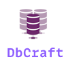

# DBCraft


DBCraft is an interpreter project designed to facilitate database migrations and schema management in multiple programming languages. The primary goal of **DBCraft** is to provide an intuitive and unified syntax for defining and modifying database structures, allowing developers to evolve their schemas in a simple and controlled manner.

## Idioms
This documentation is available on the following languages:
- [Español](README.md)
- [English](english.md)

## Inspired by YAML

DBCraft draws inspiration from [YAML](https://yaml.org/), but with adaptations and adjustments to meet the specific needs of managing database schemas. The syntax has been simplified, and custom attributes have been added to intuitively define fields, tables, relationships, and other elements.

## Features

- Simplified and readable syntax for defining and managing database schemas.
- Cross-platform support for popular programming languages.
- Efficient migration and transformation of database structures and data.
- Structure updates through scripting files (.tmg).
- Version control and change tracking for schemas.
- Integration with various database management systems.

## Supported Languages

- Visual Foxpro 9.0
- Windev (WLanguage)

## Example

Below is an example of how a table definition would look in DBCraft:

```yaml
- table:
  name: clients
  description: "Table that stores client information."
  fields:
    - name: id
      type: int
      size: 10
      primaryKey: true
      autoIncrement: true
      description: "Unique auto-incremental identifier for the client."

    - name: name
      type: varchar
      size: 50
      allowNull: false
      description: "Client's name."

    - name: email
      type: varchar
      size: 100
      allowNull: true
      description: "Client's email address."

    - name: phone
      type: varchar
      size: 20
      allowNull: true
      description: "Client's phone number."

    - name: address
      type: varchar
      size: 100
      allowNull: true
      description: "Client's address."

    - name: created_at
      type: datetime
      allowNull: false
      description: "Date and time of client creation."

    - name: updated_at
      type: datetime
      allowNull: true
      description: "Date and time of the client's last update."
```

## This example shows how to define a table with foreign keys

```yaml
# Definition of the "Clients" table
- table:
  name: Clients
  description: "Table that stores client information."
  fields:
    - name: id
      type: int
      size: 11
      autoIncrement: true
      primaryKey: true
    - name: name
      type: varchar
      size: 100
    - name: address
      type: varchar
      size: 200

# Definition of the "Invoices" table
- table:
  name: Invoices
  description: "Table that stores invoice information."
  fields:
    - name: id
      type: int
      size: 11
      autoIncrement: true
      primaryKey: true
    - name: client_id
      type: int
      size: 11
      foreignKey:
        fkTable: Clients
        fkField: id
        onDelete: cascade
        onUpdate: restrict
    - name: date
      type: date

# Definition of the "InvoiceDetail" table
- table:
  name: InvoiceDetail
  description: "Table that stores invoice details."
  fields:
    - name: id
      type: int
      size: 11
      autoIncrement: true
      primaryKey: true
    - name: invoice_id
      type: int
      size: 11
      foreignKey:
        fkTable: Invoices
        fkField: id
        onDelete: cascade
        onUpdate: restrict
    - name: product
      type: varchar
      size: 100
    - name: quantity
      type: int
      size: 11
    - name: price
      type: double
      size: 10
      decimal: 2
```

## Contributions

Contributions and suggestions are welcome! If you want to collaborate on the development of DBCraft or have ideas to improve it, feel free to create a pull request or open an issue on the repository.

## Tutorial

[This tutorial](tutorial_en.md) will explain all the attributes you need to know to start creating your tables..

## License

DBCraft is distributed under the MIT License. See the LICENSE file for more details.

## Donations

If you find the tools I've developed useful and would like to support my work, consider making a donation. Your contribution will help maintain and improve this project, as well as fund the creation of new tools for programmers.

[](https://www.paypal.com/donate/?hosted_button_id=LXQYXFP77AD2G)

[Become my Patron](https://www.patreon.com/IrwinRodriguez)
