```
table           ::= HYPHEN 'table' COLON CRLF tableAttributes
tableAttributes ::= name | description | fields | composed
fields          ::= 'fields' COLON CRLF (fieldAttributes)*
fieldAttributes ::= name | type | size | decimal | allowNull | default | description | autoIncrement | primaryKey | index | foreignKey
foreignKey      ::= 'foreignKey' DOT CRLF foreignKeyAttributes
foreignKeyAttributes ::= 'fkTable' | 'fkField' | 'onDelete' | 'onUpdate'
composed        ::= 'composed' DOT CRLF composedAttributes
composedAttributes   ::= (columns)+
columns         ::= name | sort | unique
name            ::= 'name' DOT value
description     ::= 'description' DOT value
type            ::= 'type' DOT value
size            ::= 'size' DOT value
decimal         ::= 'decimal' DOT value
allowNull       ::= 'allowNull' DOT value
default         ::= 'default' DOT value
autoIncrement   ::= 'autoIncrement' DOT value
primaryKey      ::= 'primaryKey' DOT value
index           ::= 'index' DOT value
value           ::= STRING | IDENTIFIER | NUMBER | TRUE | FALSE | NULL | array
array           ::= LBRACKET (value)* RBRACKET
```

**table:**

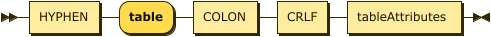

```
table    ::= HYPHEN 'table' COLON CRLF tableAttributes
```

**tableAttributes:**

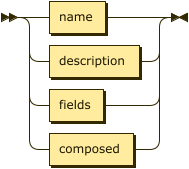

```
tableAttributes
         ::= name
           | description
           | fields
           | composed
```

referenced by:

* table

**fields:**

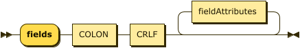

```
fields   ::= 'fields' COLON CRLF fieldAttributes*
```

referenced by:

* tableAttributes

**fieldAttributes:**

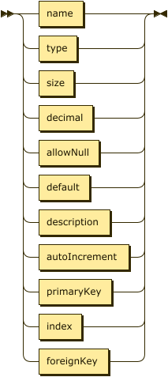

```
fieldAttributes
         ::= name
           | type
           | size
           | decimal
           | allowNull
           | default
           | description
           | autoIncrement
           | primaryKey
           | index
           | foreignKey
```

referenced by:

* fields

**foreignKey:**

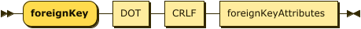

```
foreignKey
         ::= 'foreignKey' DOT CRLF foreignKeyAttributes
```

referenced by:

* fieldAttributes

**foreignKeyAttributes:**

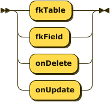

```
foreignKeyAttributes
         ::= 'fkTable'
           | 'fkField'
           | 'onDelete'
           | 'onUpdate'
```

referenced by:

* foreignKey

**composed:**

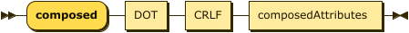

```
composed ::= 'composed' DOT CRLF composedAttributes
```

referenced by:

* tableAttributes

**composedAttributes:**


```
composedAttributes
         ::= columns+
```

referenced by:

* composed

**columns:**

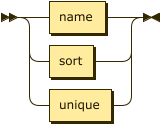

```
columns  ::= name
           | sort
           | unique
```

referenced by:

* composedAttributes

**name:**

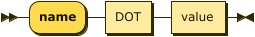

```
name     ::= 'name' DOT value
```

referenced by:

* columns
* fieldAttributes
* tableAttributes

**description:**

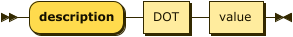

```
description
         ::= 'description' DOT value
```

referenced by:

* fieldAttributes
* tableAttributes

**type:**

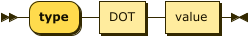

```
type     ::= 'type' DOT value
```

referenced by:

* fieldAttributes

**size:**

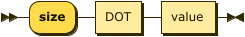

```
size     ::= 'size' DOT value
```

referenced by:

* fieldAttributes

**decimal:**

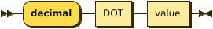

```
decimal  ::= 'decimal' DOT value
```

referenced by:

* fieldAttributes

**allowNull:**

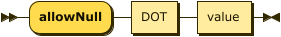

```
allowNull
         ::= 'allowNull' DOT value
```

referenced by:

* fieldAttributes

**default:**

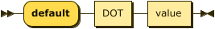

```
default  ::= 'default' DOT value
```

referenced by:

* fieldAttributes

**autoIncrement:**

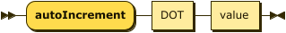

```
autoIncrement
         ::= 'autoIncrement' DOT value
```

referenced by:

* fieldAttributes

**primaryKey:**

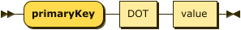

```
primaryKey
         ::= 'primaryKey' DOT value
```

referenced by:

* fieldAttributes

**index:**

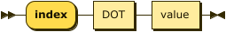

```
index    ::= 'index' DOT value
```

referenced by:

* fieldAttributes

**value:**

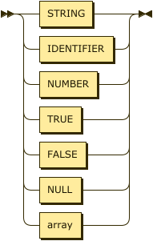

```
value    ::= STRING
           | IDENTIFIER
           | NUMBER
           | TRUE
           | FALSE
           | NULL
           | array
```

referenced by:

* allowNull
* array
* autoIncrement
* decimal
* default
* description
* index
* name
* primaryKey
* size
* type

**array:**

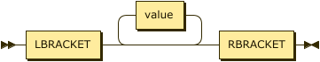

```
array    ::= LBRACKET value* RBRACKET
```

referenced by:

* value

## 
 <sup>generated by [RR - Railroad Diagram Generator][RR]</sup>

[RR]: http://bottlecaps.de/rr/ui